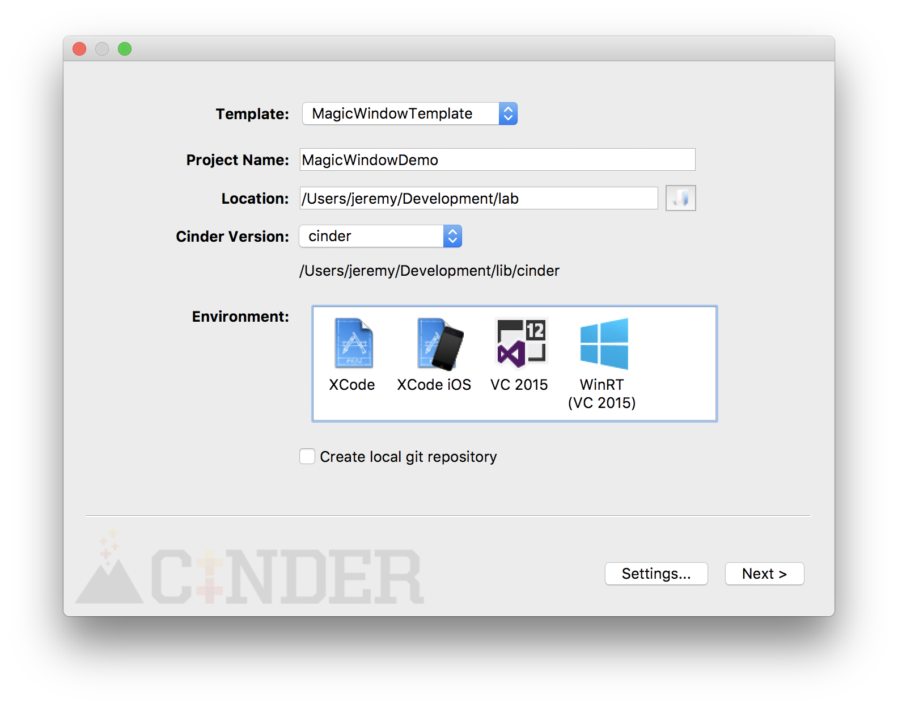
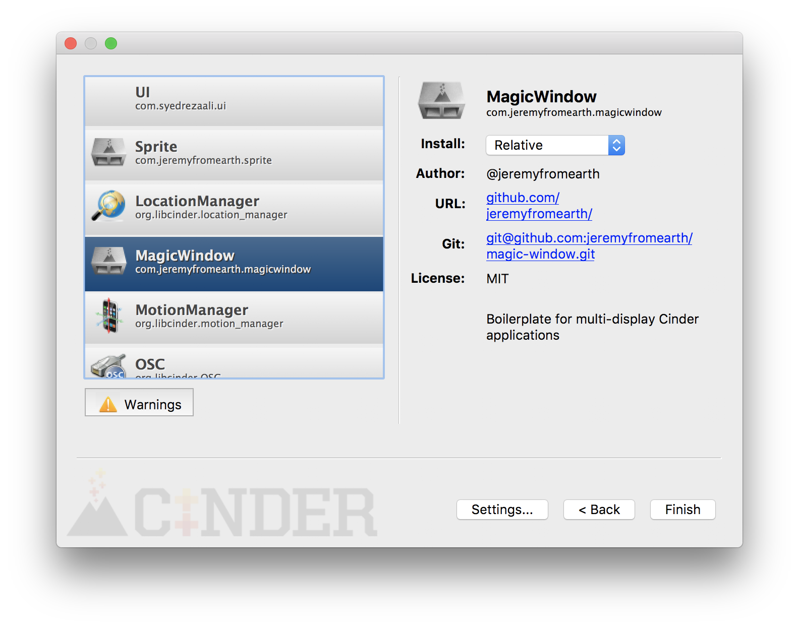

# magic-window
Magic Window aims to enable developers to create large (as in lots of pixels large), high performance Cinder apps with minimal setup. It is built with the development process in mind and can easily scale down otherwise gigantic apps to fit even on a laptop screen. The library allows content to be rendered in a global coordinate space, which means that there is no need to translate coordinates per window. It uses `ci::signals` just like Cinder, to dispatch global update, draw, mouse, and keyboard events. It also takes care of some other not so obvious head scratchers such as accounting for the OSX toolbar and calling window configuration methods in the correct order. Generally, Magic Window apps are not much different from regular Cinder apps.

## Getting Started
First you'll want to clone MagicWindow into the `blocks` dir indside of your copy of Cinder.
```
cd cinder/blocks
git clone git@github.com:jeremyfromearth/magic-window.git
```

Once the code is checked out you can use Tinderbox to create a MagicWindow app. This will use a different template to create the project.


You'll also want to make sure MagicWindow is added to your project on the next menu in Tinderbox. I like to use a `Relative` install rather than a copy.


## A Simple Example App
Below is the code that is generated when you use the MagicWindow template from Tinderbox.
```
// cinder
#include "cinder/app/RendererGl.h"

// magicwindow
#include "magicwindow.h"

using namespace ci::app;
using namespace magicwindow;

class MagicWindowBasicApp : public magicwindow::app {
public:
    void setup();
};

void MagicWindowBasicApp::setup() {
    initialize();
}

CINDER_APP(MagicWindowBasicApp, RendererGl)
```
Note `MagicWindowBasicApp` extends `magicwindow::app`, rather than `cinder::app::App`. Also note the lack of the `update()` and `draw()` methods that are typically present in a newly created Cinder app. These methods are not present because, in general, a Magic Window app will connect to global `update` and `draw` signals emitted from a `magicwindow::context` object. More on that later... Another thing to notice is the `initialize` method in the `setup` method. `initialize()` is responsible for loading a config file that describes the configuration of windows in a magic window app. Let's take a look at that the contents of that file.
```

## Configuration
{
  "bezels": false, 						// draw screen outlines when true	
  "cursor" : true,						// show or hide the cursor
  "keys" : true,							// enable default keys bindings
  "fullscreen" : false,				// launch windows in fullscreen mode (scale & top are ignored when true)
  "scale" : 0.25,							// the scale of the application (useful for development on a smaller screen)
  "display" : "grid",					// the display mode, options are "grid", "display" and "custom"
  "top": false,								// whether the windows are always on top of all other content
  "windows" : {								// the configuration for the display setting (more on this in below...)
    "rows" : 3,
    "columns" : 2,
    "screen_width" : 1920,
    "screen_height" : 1024
  }
}
```
The above is pretty straightforward. The only properties that require a little further explaining are `display` and `windows`. The value of the `windows` property is different for each of the valid values of the `display` property. 

There are three valid values for `display`: 
 * `grid`: Layout the windows in grid
 * `display`: Create a window for each available display connected to the computer
 * `custom`: Layout the windows, each with a custom width, height, x and y
 
Here are examples of the `windows` property, specific to each of the values of `display`:
```
// create a gid array of windows
"display": "grid", 
"windows": {
  "rows": 3, 
  "columns": 3, 
  "screen_width": 1920, 
  "screen_height": 1080
}
``` 
```
// create a window for every physical display available
"display": "display", 
"windows": {}
``` 
```
// layout the windows in a custom configuration
"display": "custom", 
"windows": [
  {"x": 0, "y": 0, "w": 1920, "h": 1080}, 
  {"x": 3840, "y": 0, "w": 1920, "h": 1080}, 
  {"x": 5760, "y": 2160, "w": 1920, "h": 1080}, 
]
``` 

## Particles Demo
Here is a screen shot of the Paricles demo a Magic Window app, consisting of a 3x4 grid layout of 1920x1080 windows scaled to fit on my desktop at 20% scale.


Well skip over the fine details of the particle code here, but take a look at how the particle handles updating the simulation and drawing the particles to the screen. The constructor for the Particles class, is supplied with a reference to a global `magicwindow::context` object. This object provides access to `ci::signals::Signal` signals. The `update` signal is emitted once per frame and the `draw` signal is emitted once per frame per window. 

```
Particles::Particles(magicwindow::context & ctx) : ctx(ctx) {
  ctx.signals.update.connect([&]{update();});
  ctx.signals.draw.connect([&]{draw();});
}

void Particles::update() {
  // update the simulation
}

void Particles::draw() {
  // draw the simulation
}
```
